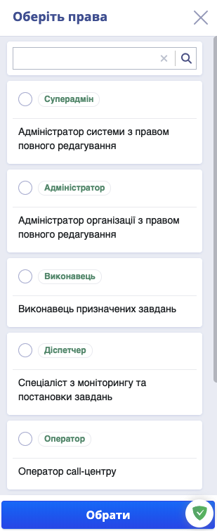
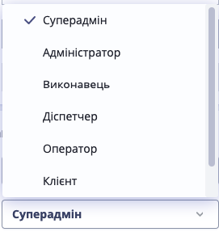

# Інструкція адміністратора організації

**Адміністратор** &mdash; користувач системи з найбільшими правами.

Права та обов'язки адміністратора:

* [робота з користувачами](#робота-з-користувачами)
* оперування новинами у системі
* експорт вхідних звернень і заявок

## Робота з користувачами

* [управління списком користувачів](#управління-списком-користувачів)
* [створення нових користувачів](#створення-нових-користувачів)
* [редагування](#редагування-користувачів) та [надання різних прав доступу користувачам](#зміна-прав-доступу-користувачів)

Роботу, пов'язану з користувачами, Адміністратор проводить у **Списку користувачів**. Щоб потрапити до нього &mdash; натисніть на правій панелі на кнопку  
  
### Управління списком користувачів

| |
|-|
| [Наверх](#інструкція-адміністратора-організації) |
___

### Створення нових користувачів

Щоб створити користувача у вікні списку користувачів виконайте наступні дії:

1. Натисніть кнопку  у верхньому правому кутку екрана

2. У вікні: що відкрилося, Введіть необхідні Контактні дані: Прізвище, Ім'я, По-батькові, Телефон та Електронну пошту

3. Створіть новому користувачу Логін та Пароль

4. Вкажіть Інформацію в компанії: Виберіть Підрозділ та призначте Посаду

5. Натисніть 

    > ⚠️  ВАЖЛИВО! 
    >
    >* Поля з зірочкою * &mdash; обов'язкові для заповнення
    >
    >* Логін має складатися тільки з латинських літер
    >* Пароль має містити щонайменше 7 символів

Якщо ви бажаєте додати фото користувачу: 
 1. Натисніть на іконку  для завантаження фото 

 2. Після успішного завантаження фото натисніть  

| |
|-|
| [Наверх](#інструкція-адміністратора-організації) |
___

### Редагування користувачів

Щоб відредагувати інформацію про користувача у вікні списку користувачів виконайте наступні дії: 

1. Оберіть у списку потрібного користувача та натисніть на , або в режимі просмотру профіля натисніть  

2. У режимі редагування внесіть необхідні зміни та натисніть 

| |
|-|
| [Наверх](#інструкція-адміністратора-організації) |
___

### Зміна прав доступу користувачів

Додавати або змінювати права доступу користувачу можна  при створенні нового користувача або з режиму редагування:

1. **При створенні нового користувача** для додавання прав натисніть  та у вікні, що відкрилося, оберіть потрібну роль: 

    

2. Натисніть  

Щоб змінити права існуючого користувача, виберіть його та перейдіть у **режим редагування**:

1. Натисніть на поточні права  та оберіть нові з випадаючого списку: 

    

2. Натисніть  

 > ⚠️  ВАЖЛИВО! 
    >
    >Для збереження нової інформації потрібно після кожної зміни натискати  
___
| | |
|-|-|
| [Наверх](#інструкція-адміністратора-організації) | [До змісту](../ToC.md)
___
