# Інструкція оператора контакт-центру

Ця інструкція призначена для операторів контакт-центру та показує, як обробляти Вхідні.  
Вхідні &mdash; це повідомлення від клієнтів, які потрібно реєструвати у системі.

## Екран Вхідних
Оператор працює з системою на **Екрані Вхідних**. Він автоматично відкривається після [входу у систему](../login_logout.md). Якщо цього не відбулося, або ви знаходитесь на іншому екрані &mdash; відкрийте Екран Вхідних, натиснувши на правій панелі кнопку :  
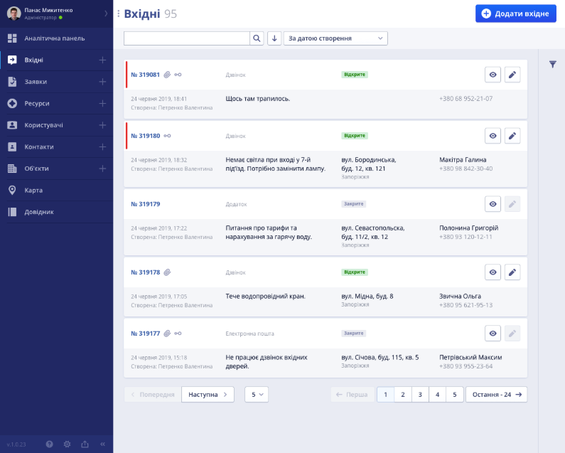  

На екрані представлено список Вхідних з короткою інформацією про кожне Вхідне (номер, статус, присутніть прив'язаних об'єктів  та додатків , ким і коли створено, опис, адреса, контакт).

Можливості оператора:
1. Перегляд Вхідного  
2. Редагування Вхідного 
3. [Створення Вхідного](#створення-вхідного)
4. [Пошук та фільтрація Вхідних](#сортування-та-фільтри)
5. ...

|                                                |
|------------------------------------------------|
| [Наверх](#інструкція-оператора-контакт-центру) |
___

## Створення Вхідного 

Вхідні можуть надходити до оператора 3-мя різними способами:
 >
 >* Телефонний дзвінок
 >* Звернення з мобільного додатка
 >* Зворотній зв'язок (e-mail)

 Оператор реєструє вхідне у системі за допомогою  інтерфейсу створення Вхідного.

 Незалежно від способу надхождення, натиснувши кнопку  зліва зверху Екрана Вхідних, оператор потрапляє до **Екрану створення Вхідного**:

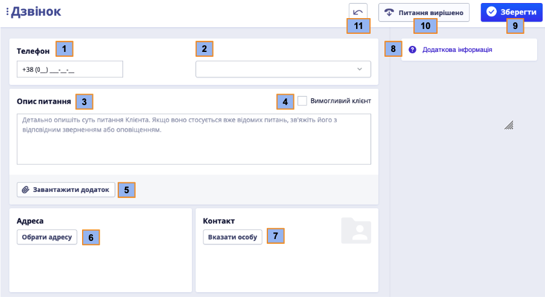

Вхідному при створенні присвоєються унікальний ID-номер ()

Щоб створити Вхідне, заповніть обов'язкові поля:  
1. Додайте контакт клієнта ():
    * Натисніть () 
    * Виберіть або додайте новий контакт у бічному меню: 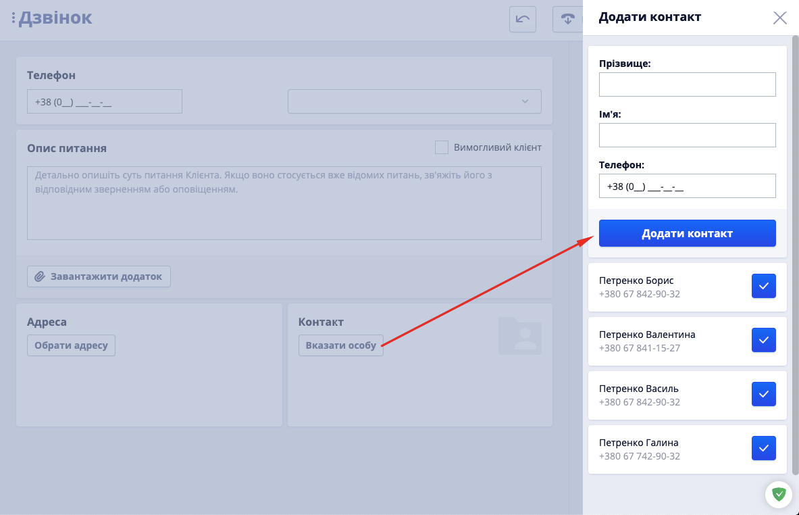
    * Оберіть потрібний контакт, натиснувши   
    
2. Додайте адресу, за якою звертається клієнт ():
    * Натисніть ()  
    * Виберіть або знайдіть адресу у бічному меню:  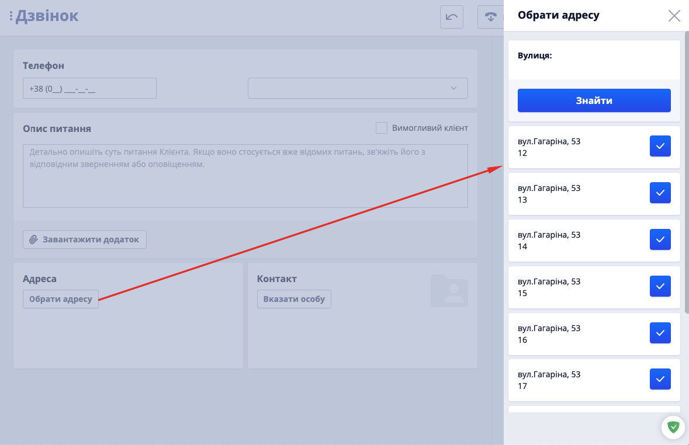
    * Оберіть потрібну адресу, натиснувши 
 

3. Введіть причину зверення клієнта у поле ()  
4. Натисніть ()  
 

    >Якщо Клієнт та/або Адреса існують у системі &mdash; зліва на Екрані створення Вхідного покажуться прив'язані до них заявки та звернення. 
    Ви можете детально подивитися всі заявки по клієнту або адресі, та при необхідності додати їх до Вхідного, натиснувши :
    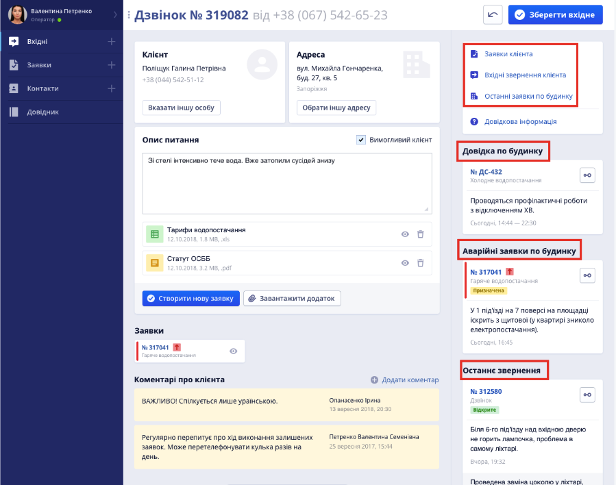

|                                                |
|------------------------------------------------|
| [Наверх](#інструкція-оператора-контакт-центру) |
___

### Додаткові дії при створенні Вхідного 

- [Створення Заявки з Вхідного](#створення-заявки-з-вхідного)
- [Коментарі](#коментарі)
- [Історія Вхідного](#історія-вхідного)
- [Робота з додатками](#робота-з-додатками)
- [Вимогливий клієнт](#вимогливий-клієнт)
- [Додаткова інформація](#додаткова-інформація)
- [Питання вирішено](#питання-вирішено)
- [Назад](#назад)

###### Створення Заявки з Вхідного
При створенні Вхідного ви можете створити Заявку, яка далі піде на обробку Диспетчером. Для цього натисніть ,щоб відкрився Екран створення Заявки:
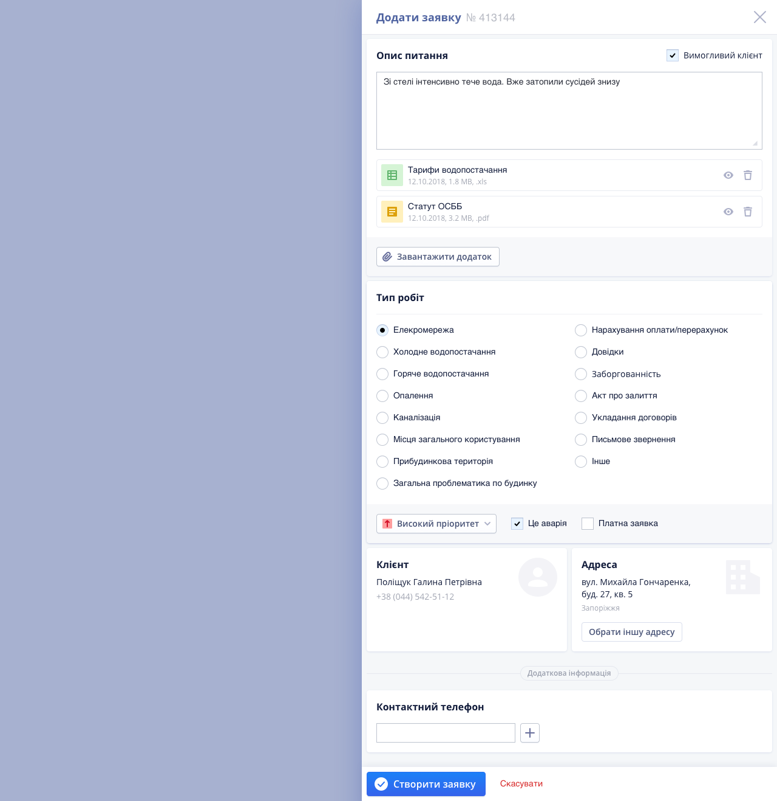
Поля "Опис", "Додатки", "Клієнт" та "Адреса" автоматично переносятся з Вхідного. При необхідності ви можете їх змінити. 

Редагування адреси при створенні Заявки з Вхідного

Для змінення адреси в режимі створення Вхідного натисніть "Обрати іншу адресу":
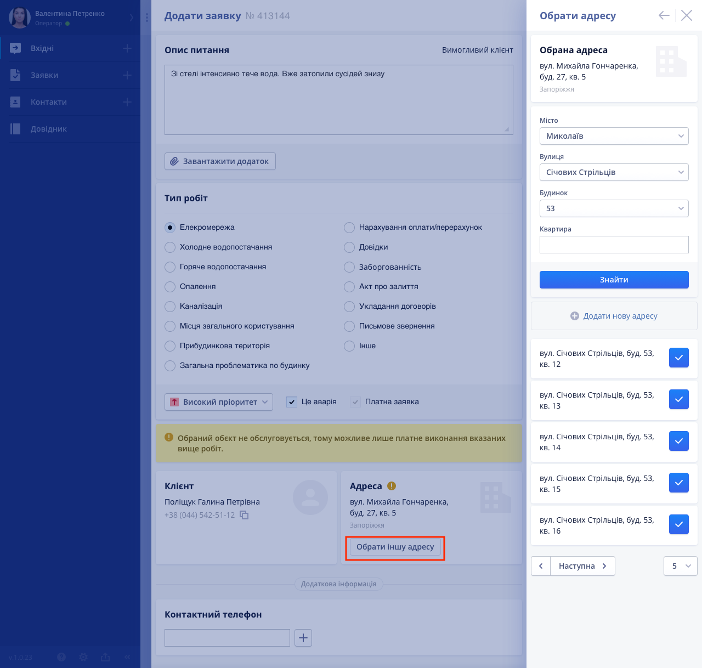
Виберіть адресу зі списку або за допомогою пошуку. 
Якщо адреси клієнта не існує &mdash; додайте ії, натиснувши 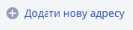:
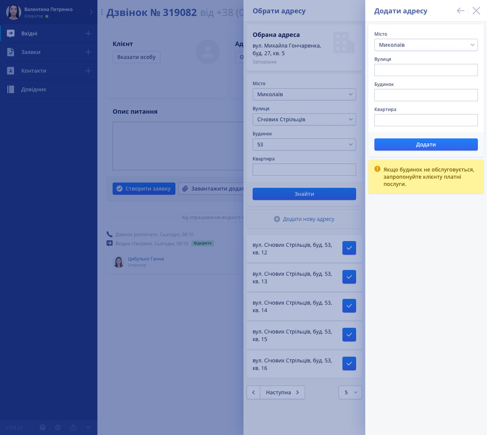
>Якщо адреса клієнта не обслуговується &mdash; ви побачите відповідне повідомлення. Заявка автоматично стане платною, і поставиться відповідна галочка:
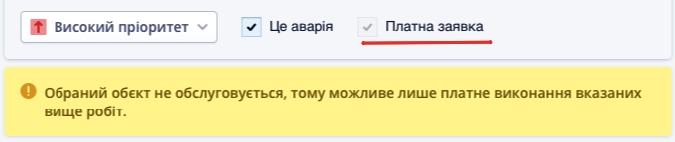
⚠️ Обов'язково сповістіть клієнта про те, що його заявка стала платною

 
  
1. Оберіть відповідний опису Тип Робіт та визначте пріоритет Заявці
>⚠️ Якщо ви поставите галочку 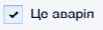 &mdash; автоматично виставиться Високий пріоритет
Далі ці приоритети може змінити Диспетчер
2. Додайте контактний телефон, за яким можна зв'язатися к клієнтом
3. Натисніть  для збереження змін. Заявка автоматично прикріпиться до Вхідного:
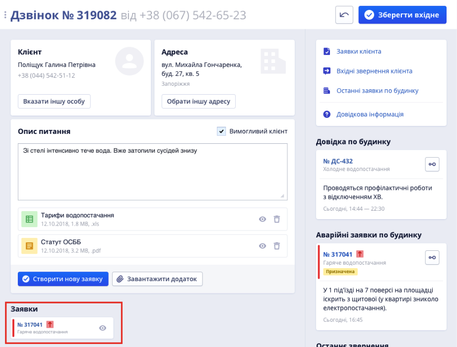
Або відмініть створення, натиснувши 

###### Коментарі
Ви можете додавати та переглядати коментарі до Вхідного, наприклад, додаткову інформацію про клієнта:
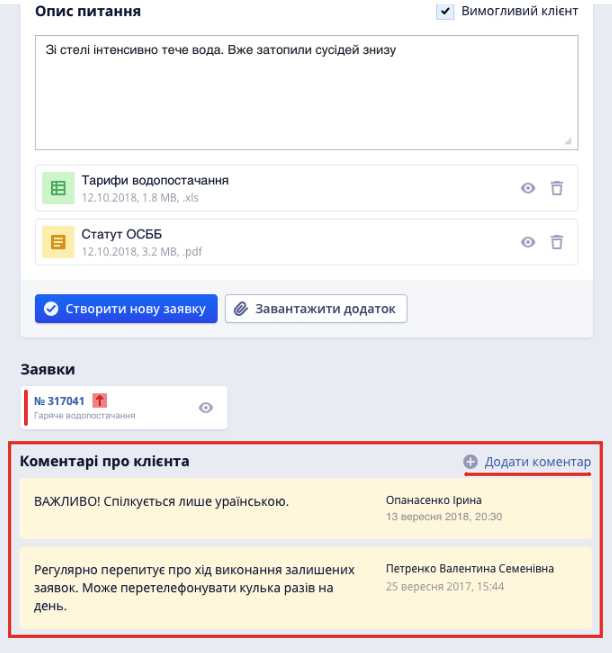

###### Історія Вхідного
Внизу сторінки Вхідного в режимі перегляду ви бачите повну історію роботи з ним:
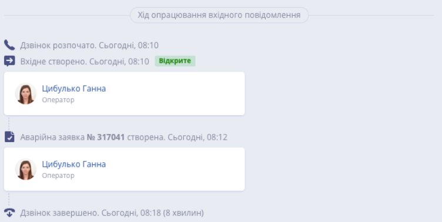

###### Робота з додатками  
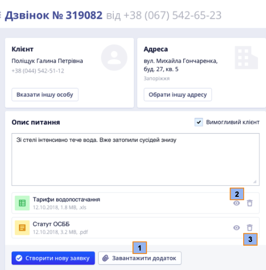
Ви можете завантажити додаток (1) до Вхідного &mdash;  прикріпити будь-яку додаткову інформацію, як текстові документи, таблиці, зображення чи інші файли, які стосуються звернення клієнта.
Також ви можете переглянути (2) або видалити (3) вже існуючі додатки з Вхідного.

###### Вимогливий клієнт
 &mdash; поставте цю галочку, якщо кліент поводиться зухвало або підвищує голос (?)

###### Додаткова інформація
 Якщо звернення клієнта потребує додаткової інформації (наприклад, його треба перенаправити до іншої служби), на Екрані створення Вхідного присутній телефонний довідник з телефонами та адресами аварійних служб міста, який ви можете відкрити кнопкою (9) 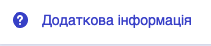.    

###### Питання вирішено
 Якщо протягом дзвінка питання було вирішено &mdash; переведіть Вхідне у закритий статус кнопкою () 
   
###### Назад
Щоб повернутися до Екрану Вхідних без збереження змін, натисніть () 

|                                                |
|------------------------------------------------|
| [Наверх](#інструкція-оператора-контакт-центру) |
___

## Сортування та фільтри 
Ви можете сортувати вхідні по типам, шукати по номеру Вхідного або телефону клієнта та застосовувати фільтри 

Фільтри бувають трьох типів:
>
>* *за адресою* &mdash; сортування по місту, вулиці, номеру будинку та квартирі
>* *за атрибутами* &mdash; сортування по типу Вхідного, статусу, типу робіт та підрозділом
>* *за датою* &mdash; сортування по даті створення та даті закриття

Після вибору необхідних параметрів фільтрів натисніть  для перегляду вхідних, які відповідають обраним параметрам
Натисніть , щоб очистити всі фільтри
Натисніть , щоб розкрити або сховати всі типи фільтрів

|                                                | |
|------------------------------------------------|-|
| [Наверх](#інструкція-оператора-контакт-центру) | [До змісту](/docs/toc/) |
___