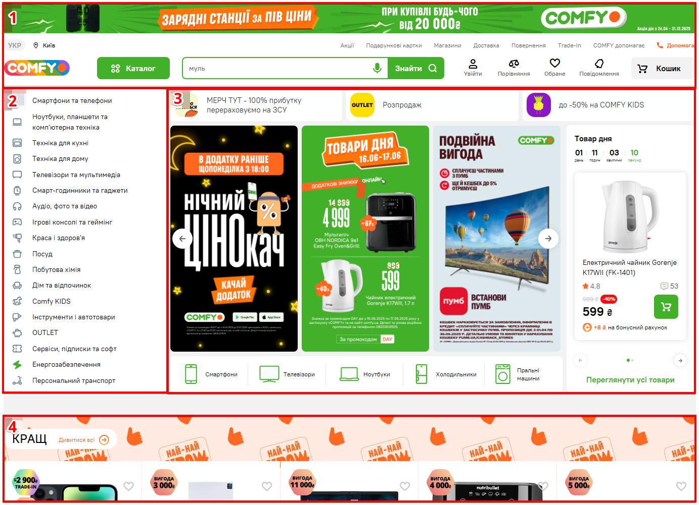
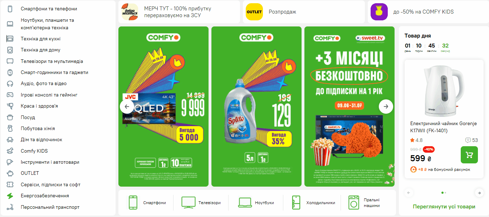
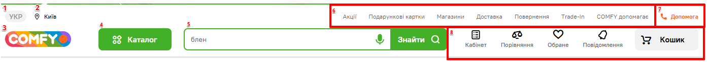
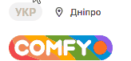
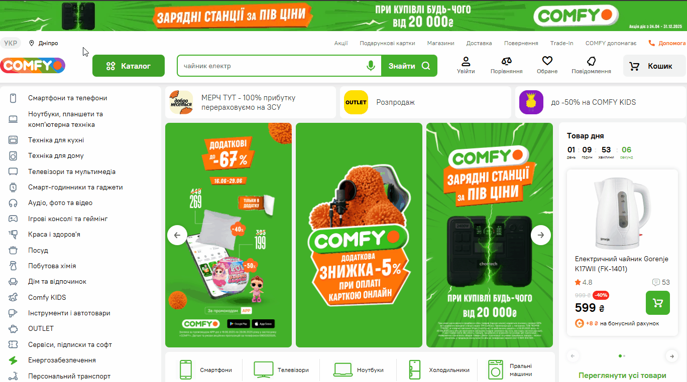
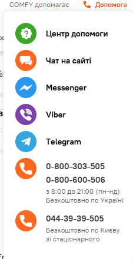
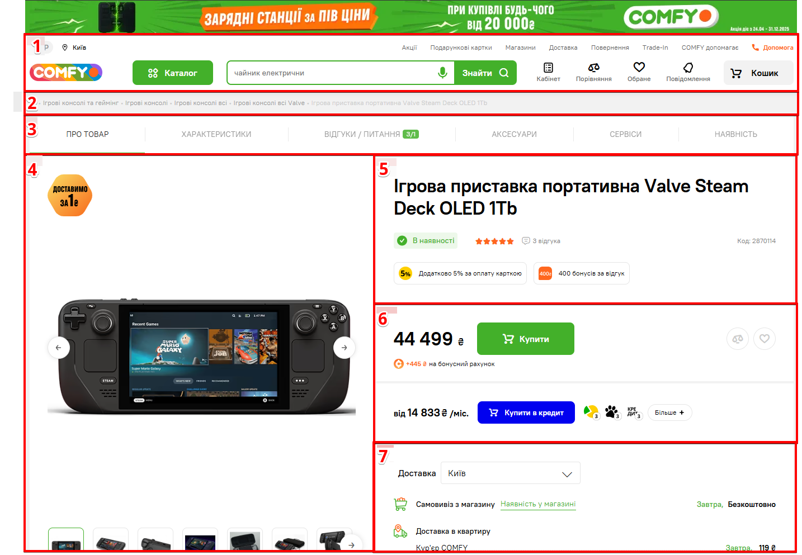

> *This illustrative guide describes the core functionality and typical issues of an e-commerce user flow using Comfy.ua as an example. The document is bilingual (UA/EN) and showcases key UI patterns, error handling, and core UX logic.*
> *Ця демонстраційна інструкція описує базову функціональність інтерфейсу інтернет-магазину на прикладі Comfy.ua. Документ є двомовним (UA/EN) та ілюструє основні сценарії використання, типові помилки та логіку інтерфейсу.*

---

# 🇺🇦 Стислий гайд по інтерфейсу COMFY

## 1. Як відкрити сайт

Щоб перейти на сайт COMFY, відкрийте браузер і введіть: `https://comfy.ua/`.

Після завантаження ви потрапите на головну сторінку з банерами, пошуком, меню та категоріями товарів:

---

## 2. Головна сторінка

На головній сторінці представлено навігаційні блоки, акційні банери та швидкий доступ до основних категорій.

| № | Елемент | Опис |
| - | - | - |
| **1**| Хедер | Верхня панель сайту, використовується для основних дій, [детальніше нижче](#хедер). |
| **2**| Каталог | Бокове меню для швидкого вибору категорії. Наведіть курсор на потрібну категорію, щоб розкрити її деталі та вибрати необхіжну підкатегорію:  |
| **3**| Акційні банери | Блок банерів знижок та акцій, активних в даний момент. Зверху знаходяться 3 банери активних акцій з переходом на відповідні розділи (Мерч, Розпродаж, Comfy Kids), по центру — блок з візуальних банерів знижок/акцій зі стрілками прокрутки по бокам, зліва — банери товарів дня. |
| **4**| Карусель | Тематичні блоки з добірками популярних товарів по категоріям (КРАЩ, Смартфони, Холодильники, Ноутбуки, і т. д.). Ці блоки допомагають швидко знайти актуальні товари без переходу в каталог:  |
| **5** (відсутній на скриншоті) | Футер | Нижнє меню з різноманітною інформацією: доставка, гарантія, контактна інформація і т. д. |

---

### Хедер

Хедер — це верхня панель сайту COMFY, яка доступна на кожній сторінці. Вона забезпечує швидкий доступ до ключових функцій і допоміжних сервісів:

| № | Елемент | Опис |
| - | - | - |
| **1** | Перемикач мови | Доступні мови інтерфейсу: українська (за замовчуванням) та російська. Натисніть для вибору мови:  |
| **2** | Геолокація | Вибір міста. На основі міста показується різна доступність товарів, умови доставки та графік магазинів:  |
| **3** | Логотип COMFY | Клік веде на головну сторінку. |
| **4** | Каталог | Клік на кнопку відкриває меню категорій, яке дублює функціональність Каталогу зліва головної сторінки. |
| **5** | Пошуковий рядок | Можна ввести назву товару, бренд або артикул. При фокусі на полі з’являється список популярних запитів. Пошук підтримує введення голосом. Поле пошуку підтримує автозаповнення — пропозиції товарів, категорій та підкатегорій з’являються одразу після введення першої літери.|
| **6** | Посилання | Головні інформаційні розділи: **Акції**, **Подарункові картки**, **Магазини**, **Доставка**, **Повернення**, **Trade-In**, **COMFY допомагає**. |
| **7** | Допомога | Навівши курсор, з’являється список каналів підтримки: онлайн-чат, Messenger, Viber, Telegram, телефонні лінії:  |
| **8** | Іконки користувача | - **Увійти / Кабінет** — [авторизація/реєстрація](#3-авторизація--реєстрація) або перехід у профіль. - **Порівняння** — порівняння товарів, доданих в список . - **Обране** — список збережених позицій. - **Повідомлення** — центр сповіщень. - **Кошик** — перелік обраних для купівлі товарів. |


Якщо користувач не залогінився на сайті — по кліку на **Обране** та **Повідомлення** відкриється попап [авторизації/реєстрації](#3-авторизація--реєстрація).


---

## 3. Авторизація / Реєстрація

Для створення нового облікового запису або для входу в існуючий:

1. Натисніть **«Увійти»** в хедері → відкриється попап входу з варіантами входу по номеру телефону, або через Google акаунт:

    

2.1 Для входу по номеру телефону введіть його у відповідне поле. Підтримуються тільки українські номера (+380). Обов'язкове поле.
2.2 Оберіть, як отримати код підтвердження — СМС або двінок.
2.3 Введіть **SMS-код** або код з двінка, отриманий на ваш номер:

    

> Для того, щоб не вводити номер/код кожен раз — можна поставити чекбокс **Запам'ятати мене**.

2.4 Натіснить **Увійти** для входу в акаунт (особистий кабінет).

3.1 Для входу через Google натисніть на відповідну кнопку, увійдіть або оберіть свій акаунт, вкажіть номер телефону для зв'язку з акаунтом, та натіснить **Увійти**.


Типові помилки під час авторизації/реєстрації:

* **Не введено номер телефону** — *Поле обов'язкове до заповнення*.
* **Невірний формат номера** — *Необхiдно вiрно вказати код країни +380. Приклад: +380 12 345 6789*.
* **Не введено SMS-код** — *Поле обов'язкове до заповнення*. Доступна кнопка **«Вислати код ще раз»**.
* **Неправильно введений номер телефону** — Доступна кнопка **«Змінити номер телефону»**.
* **Проблеми з мережею** — *Виникла помилка*.


---

## EN Interface Overview

### 4. Product Page Overview

Click on any product on the site to open the product detail page:

The page is divided into structured blocks to help users quickly find key information and complete purchases efficiently:

| No. | Section | Description |
|-----|---------|-------------|
| **1** | Header | Persistent top navigation bar with logo, search, catalog access, user icons, and help tools. See [Header](#хедер) for more info. |
| **2** | Breadcrumb Navigation | Displays the full category path. Allows users to return to any parent category. |
| **3** | Tab Bar | Switches between tabs: **Product Info**, **Specifications**, **Reviews & Questions**, **Accessories**, **Services**, **Availability**. |
| **4** | Image Gallery | Carousel with zoomable product images (click to zoom). Users can click arrows or thumbnails to browse. |
| **5** | Product Info | Includes product name, availability status, rating, bonuses (e.g., cashback), and article code. |
| **6** | Purchase Block | Displays price, "Buy" button, bonuses, and credit or installment options. Also includes compare  and wishlist  icons. |
| **7** | Delivery & Pickup | Lets users select delivery city. Shows pickup and delivery options, availability in local stores, and estimated delivery time. |

---

#### Additional Notes

* **Tabs** below the image (Section 3) allow users to dive deeper into product details without leaving the page.
* The **"Buy"** button moves to the Tab Bar (Section 3) when scrolling.
* If the product is unavailable, the "Buy" button is replaced with **Notify Me**.
* The **Delivery & Pickup** (Section 7) info dynamically changes based on the selected city.

---


*This documentation is illustrative and not affiliated with Comfy.ua.*

