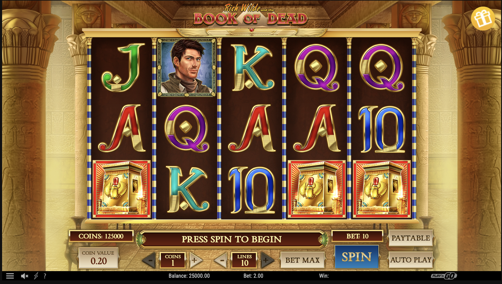
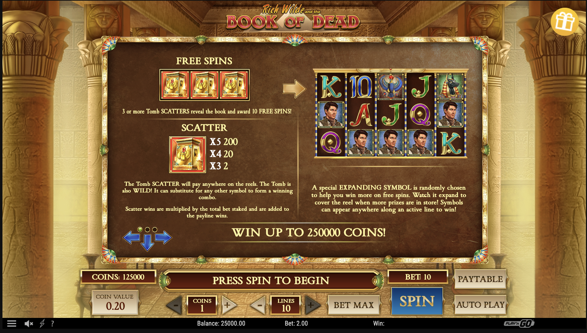
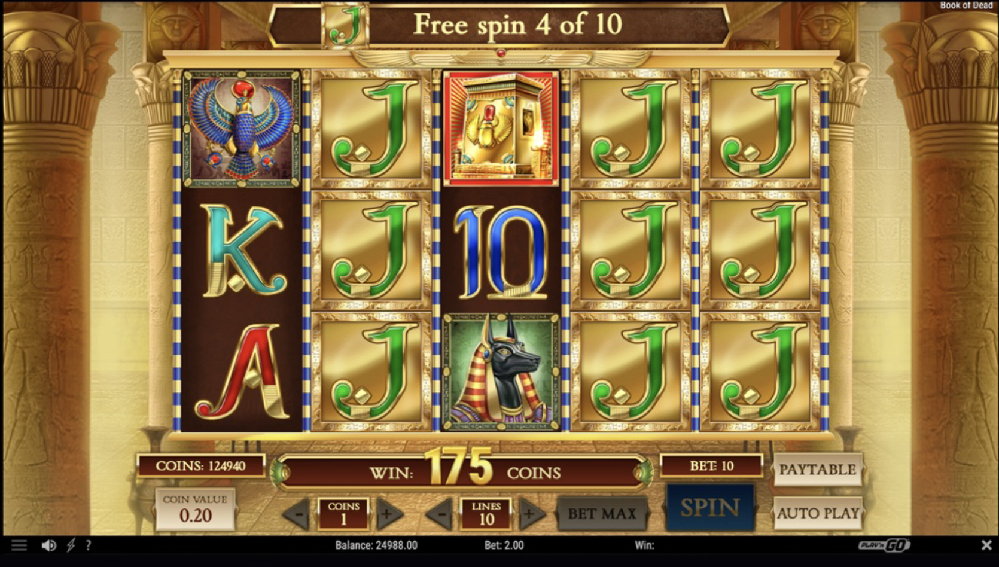

## Task Description

### Part 1: Product Sheet Creation

Could you please analyze a slot game (any slot provider) and create a Product Sheet (it can be a doc of your own choice or a mixture of the RNs, Game Sheet, Marketing Doc): **1 page, 3 pictures**.
*zero tolerance for plagiarism

### Part 2: Game Rules Documentation

Please write the Game Rules for the slot game based on the description below.
Just the unique parts — bonus symbols + features (no need to describe buttons, how to play section, etc.). Paragraphs below — the parts of the concept document (we get such documents from the game producer after the game kick-off meeting).
  please express your vision; be creative;
**good luck!

**Theme**:

Earth, space-themed features, astronauts, rockets, meteor storms, etc.

**Base**:

Layout 5×3. 50 Lines. Payments from left to right. 9 common symbols, Wild, Scatter, and Bonus.

**Features**:

- Wild substitutes all symbols except Scatter and Bonus symbols. Wild lands on all reels.
- Free spins are triggered by landing 3+ Scatter symbols. 3 - 10 Free Spins, 4 - 15 Free Spins, 5 - 25 Free Spins.

- Symbols that are available during Free Spins:H1,H2,H3,H4, Scatter, Wild, Bonus symbol. 3+ Scatters during Free Spins give +5 spins.

- 6+ Bonus symbols trigger a Bonus game with Hold and Win mechanics. Game starts with 3 respins.
    Every new symbol resets the counter up to 3.Bonus symbols’ values: ×1, ×2, ×3, ×4, ×5, ×10, ×15,× 20, ×50, ×100, Mini ×150, Minor ×500, Major ×1000.When the whole field is filled up by coins it will be GRAND Jackpot - 10000x.

**Symbols**:

Scatter
3+ scatter trigger FS
×5 - 100TB
×4 - 15TB
×3 - 2TB

Wild
Substitutes for all symbols except Scatter and Bonus
No payout

**Bonus**

**H1**
×5 - 3TB
×4 - 1TB
×3 - 0.2TB
×2 - 0.1TB

**H2**
×5 - 2TB
×4 - 1TB
×3 - 0.2TB

**H3**
×5 - 2TB
×4 - 0.5TB
×3 - 0.1TB

**H4**
×5 - 2TB
×4 - 0.5TB
×3 - 0.1TB

**L1**
×5 - 1.5TB
×4 - 0.4TB
×3 - 0.1TB
…

___

## Task Completion

### Part 1: Product Sheet

#### 1. Game Overview

| Category | Details |
| --- | --- |
| Game title | Rich Wilde and the Book of Dead |
| Provider / Studio | Play'n GO |
| Release / Version | 2016 |
| Theme | Ancient Egypt, tomb exploration, adventure |
| Platforms | Desktop, mobile, tablet |
| Layout | 5 reels × 3 rows |
| Paylines | 10 adjustable paylines |
| Pay direction | Left to right |
| Bet range | €0.01 – €100 per spin (casino-dependent) |
| Stake controls | Coin value, coins per line (1–5), lines (1–10) |
| RTP | 96.21% (Default) / Market Dependent |
| Volatility | High |
| Max win | 5,000x stake |

Join the curious explorer Rich Wilde in a classic Egyptian adventure slot. The Tomb symbol acts as both Wild and Scatter, triggering 10 Free Spins with a randomly selected Expanding Symbol that can fill entire reels for high-potential payouts. This is a high-volatility game where most win potential sits in the Free Spins feature.

  <figure style="flex:1;margin:0;">
    
    <figcaption style="font-size:0.9em;line-height:1.2;">Base game UI and 5×3 reels</figcaption>
  </figure>
  <figure style="flex:1;margin:0;">
    
    <figcaption style="font-size:0.9em;line-height:1.2;">Paytable: Tomb as Wild and Scatter</figcaption>
  </figure>
  <figure style="flex:1;margin:0;">
    
    <figcaption style="font-size:0.9em;line-height:1.2;">Free Spins: Expanding Symbol fills reels</figcaption>
  </figure>

**Reference**: In-game paytable and public game data (Play’n GO) based on https://slotcatalog.com/en/slots/Book-of-Dead

#### 2. Core Symbols

- **Tomb Symbol (Wild & Scatter):**
  - **Wild:** Substitutes for all regular symbols to complete winning combinations on active paylines
  - **Scatter:** 3+ Tomb symbols anywhere on the reels trigger 10 Free Spins. Scatter wins pay independently of paylines and are multiplied by the total bet (see paytable for exact values)

- **High Symbols:**
  - **Rich Wilde (Adventurer)**: 5× = 500× bet, 4× = 100× bet, 3× = 10× bet, 2× = 1× bet
  - **Pharaoh (Golden Mask)**: 5× = 200× bet, 4× = 40× bet, 3× = 4× bet, 2× = 0.5× bet
  - **Anubis (Jackal-headed god), Horus (Falcon god)**: 5× = 75× bet, 4× = 10× bet, 3× = 3× bet, 2× = 0.5× bet

- **Low Symbols:** Stylized card symbols **A, K, Q, J, 10** (Egyptian-themed with golden outlines)
  - **A, K**: 5× = 15× bet, 4× = 4× bet, 3× = 0.5× bet
  - **Q, J, 10**: 5× = 10× bet, 4× = 2.5× bet, 3× = 0.5× bet

#### 3. Key Mechanics

- **Free Spins Feature:** Landing 3 or more Tomb Scatter symbols anywhere on the reels triggers 10 Free Spins. Before Free Spins begin, one symbol (excluding the Tomb) is randomly selected as the Expanding Symbol. When this symbol lands on reels during Free Spins, it expands to cover the entire reel, dramatically increasing win potential

- **Gamble (optional):** After a win, players can risk the payout for x2 (Color) or x4 (Suit)

#### 4. Win Profile

- High volatility slot; most win potential sits in the Free Spins feature
- Expanding Symbol full-reel hits can drive large multi-line payouts

___

### Part 2: Game Rules

## Game Rules: Unique Features & Paytable

### 1. Special Symbols

**Astronaut Helmet (Wild)**

- Wild symbol can land on any reel and substitutes for all symbols except Scatter and Bonus
- Wild has no payout, only helps build winning lines

**Stargate (Scatter)**

- 3 or more Scatter trigger the Free Spins feature
- Scatter wins are paid regardless of paylines and are multiplied by Total Bet (TB)
- Payouts: x5 = 100TB, x4 = 15TB, x3 = 2TB

**Planet (Bonus)**

- 6 or more Bonus symbols trigger the Hold & Win Bonus Game
- Bonus symbols reveal prize multipliers or jackpot labels (Mini, Minor, Major)

### 2. Free Spins Feature

- Landing 3, 4, or 5 Scatter symbols anywhere awards 10, 15, or 25 Free Spins respectively
- During Free Spins, only High Symbols, Scatter, Wild, and Bonus symbols can land
- 3 or more Scatter during Free Spins award 5 additional Free Spins

### 3. Hold & Win Bonus (Jackpots)

- Landing 6 or more Bonus symbols in one spin in the base game or during Free Spins triggers the Hold & Win Bonus Game
- The game starts with 3 respins
- Bonus symbols lock in place and remain for the rest of the bonus
- Landing at least one new Bonus symbol resets the respin counter to 3
- The bonus ends when no respins remain or the entire bonus grid is filled
- If the entire bonus grid is filled, the Grand Jackpot is awarded

**Bonus symbol values**

- Prize multipliers: x1, x2, x3, x4, x5, x10, x15, x20, x50, x100
- Jackpot prizes: Mini x150, Minor x500, Major x1000
- Grand Jackpot: 10000x (awarded when the grid is full)

### 4. Paytable (Base Game Symbols)

**H1**

- x5 = 3TB, x4 = 1TB, x3 = 0.2TB, x2 = 0.1TB  

**H2**

- x5 = 2TB, x4 = 1TB, x3 = 0.2TB

**H3**

- x5 = 2TB, x4 = 0.5TB, x3 = 0.1TB

**H4**

- x5 = 2TB, x4 = 0.5TB, x3 = 0.1TB

**L1**

- x5 = 1.5TB, x4 = 0.4TB, x3 = 0.1TB
