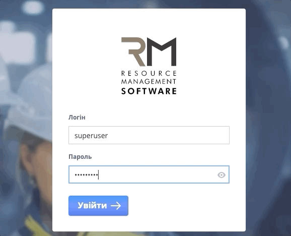
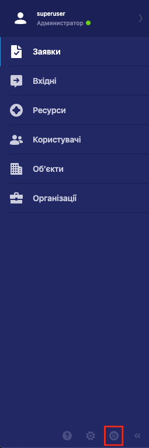
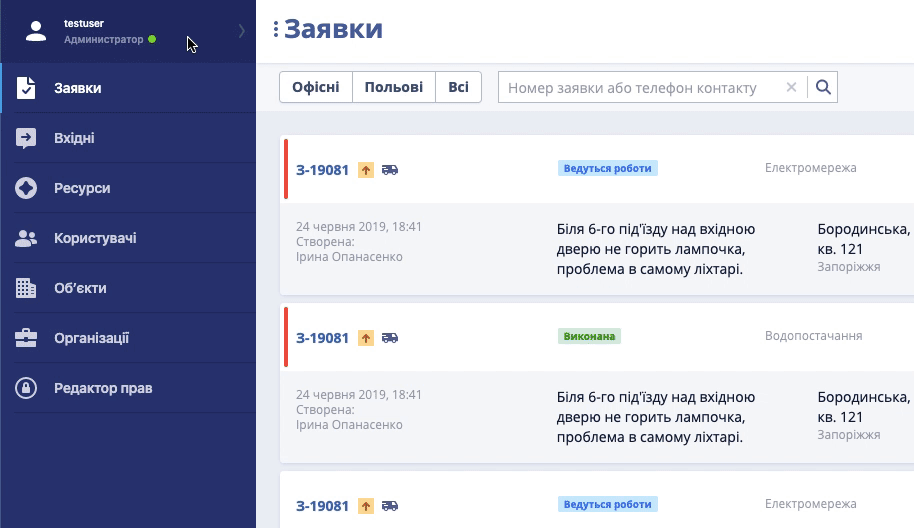
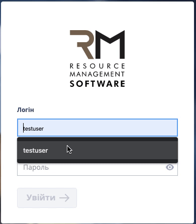

# 🔐Вхід / Вихід з системи

### Вхід в систему

Щоб увійти в систему &mdash; виконайте наступні дії:  

1. Відкрийте веб-браузер

2. Перейдіть у браузері за посиланням &mdash; http://rmsoft.io/

3. На сторінці, що відкрилася, введіть дані вашого акаунту:  
   * У поле *Логін* введіть ваш Логін, електронну пошту або телефон
   * У поле *Пароль* введіть ваш пароль
Для перегляду паролю під час введення натисніть на іконку  

4. Натисніть *Вхід*. При вірно введених даних ви побачите Основний екран системи: 

___
### Вихід з системи

Вийти з системи можна 2-ма способами:
| На будь-якому екрані | Через меню користувача |
|-|-|
|Натисніть кнопку виходу внизу  | 1. Натисніть на плашку зі своїм логіном зліва вверху    2. У меню, що відкрилося, натисніть кнопку виходу з системи |
При успішному виході з системи ви побачите Екран Логіну
___

### **Помилка** "Така комбінація логіну та паролю не знайдена"    

Якщо ви побачили цю помилку після входу:

1. Перевірте правильність введених символів

2. Перевірте мову на розкладці клавіатури

3. Переконайтеся, що клавіша **Caps Lock** не ввімкнена 

___  

### Забув пароль, що робити?
Якщо ви забули пароль:

1. Натисніть Нагадати пароль та у новому вікні введіть Електронну пошту, прив'язану до вашого акаунту

2. Натисніть Так, нагадати пароль – на вашу електронну пошту прийде лист з новим паролем

3. Відкрийте вашу електронну пошту, перейдіть за посиланням у листі та увійдіть в акаунт, використовуючи новий пароль

 

| | |
|-|-|
| [Наверх](#вхід-вихід-з-системи)| [До змісту](ToC.md)|
